Summary
=======

The work contained in this COMP 8505 Final Project is a covert backdoor
system which allows an attacker to send and receive messages using
covert channels over TCP and UDP mediums, monitor a directory for file
changes and covertly exfiltrate those files upon a change. The backdoor
component utilizes process masking & raw sockets to minimize it’s
footprint and reduce the chance of detection.

Objective
=========

-   To bring together several stealth software and backdoor concepts
    covered in class into a single covert communication application.

-   To learn how to use such an application in allowing stealthy access
    to a network or to exfiltrate data from systems within a network

-   To design and implement a complete covert application that will
    allow a user(attacker) to communicate with a server(backdoor)
    installed on the victim machine inside a network.

Assumptions
===========

-   Firewall rules drops all packets

-   The backdoor is already installed on the victim’s machine as well as
    the libraries required to run the server

Features
========

1.  **Covert Channel (TCP & UDP)**

    a.  The attacker will have the option of using either TCP or UDP for
        sending or receiving dat.

        i.  When using TCP, the command will be hidden into the sequence
            number field of the packet.

        ii. When using UDP, the command will be hidden into the source
            port field of the packet.

    b.  **Authentication**: To authenticate packets from the attacker,
        packets will have the following features:

        i.  The **TTL key** of the packets received will have the value
            of 164. This will be the value used for filtering whether it
            is the attackers IP or not.

        ii. Using a password to authenticate packets. An encrypted
            password will be placed inside the payload of every
            packet sent. Once a packet passes the TTL filter, it will
            begin decrypting the payload and check it against
            the password. If and only if the password matches, then will
            the command be deciphered.

    c.  **Sequencing:**

        i.  The payload field will contain the following information
            delimited by newline characters:

            **Password + “\\n” + UID + “\\n” + position + “\\n” +
            total**

            1.  The UID will allow the program to store commands split
                into multiple commands under a single **Unique
                Identifier**(UID)

            2.  The position and total indicate which message out of a
                sequence has been received (eg. Message 1 out of 3)

> 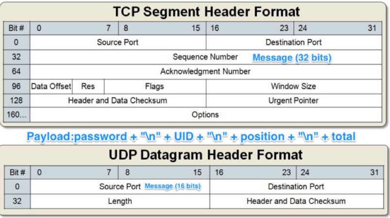

1.  **Backdoor**

    a.  Process Masking: The backdoor program will have a different
        process name so as to mask it from users who may check processes
        that are running in the system.

    b.  Covert Channels: It can use both TCP and UDP connections to
        receive and SEND packets back to the attacker. When sending the
        output back to the attacker, the hidden data will be hidden
        inside the sequence number when using TCP and into the source
        port when using UDP.

2.  **File Monitoring**

    a.  A separate process running on the backdoor that will monitor any
        file creation and modification on a directory.

    b.  When any changes occur on the directory(file creation and
        modification), it will send that file via the covert channels to
        the client(attacker).

Implementation
==============

There are two components in implementing the covert communication
application. One is the client (attacker) and the other is the server
(backdoor).

Client
------

-   External libraries required to be installed before running
    **client.py**

    -   Scapy

    -   Pycrypto

    -   parseConfig (a configuration file parser that we built)

-   To run the **client.py**.

    -   Before running the program, make sure that the necessary changes
        in the configuration file has been made. (Local IP and ServerIP)

    -   To run the program:

        -   Python client.py

The client.py has two main components when it runs. 

 1. The first component is an interactive command line where it allows
    the user (attacker) to send commands to the server (backdoor) and
    the server sending back an output. In this component, the user
    starts off with a command line interface asking it to input a
    command, once the user has chosen what command they want to send, we
    encrypt that command and then changing the encrypted command into
    bits. We then send it to our chunker method where we chunk the bits
    into the correct amount depending on the user input if they wanted
    to use **TCP** or **UDP**. If they had chosen TCP, we will be
    chunking the bits into 32 bits because we will hide the data into
    the sequence number field whereas if the user had chosen UDP, then
    we will be chunking the bits into 16 bits because we will hide the
    data into the source port field. Once we have the correct amount of
    bits, we then send it to our packet crafting method where we first
    check how many packets we will need to create and send and put a
    unique identifier on that set of packets. Once we have done that, we
    then create all the packets and inside the payload of the packet, we
    add in an encrypted authentication password to make sure that the
    server is indeed decrypting the correct packet. On top of that, we
    set the **TTL** of the packet to 164 before sending it over to the
    server. Once the packet is sent, we then listen for a response from
    the server in which we have set a timeout of 10 seconds in case that
    the output of the command requires many packets. Once we have
    received a packet, we check if the TTL matches ours and then we
    decrypt the payload and also check to see if the password matches
    with ours. Once it matches, we store the sequence number into an
    array, if it’s TCP, and/or source port into an array, if it’s UDP,
    and then change it into bits. Once we have the bits of all the
    sequence number/source port, we then decrypt them and combine them
    all together and print the output in the terminal.
    
 2. The second component is running on a second process that is created
    at the start of the program. All the process does is listen for any
    packets on port 80 with the correct TTL and the correct
    authentication password on the payload. Once we receive, the first
    packet, we will be able to find out how many packets we are
    expecting from the payload. We then wait for all the packets we need
    and then sending it to the writeFile method where we re-create the
    file. We first change everything into characters and decrypt the
    whole thing. We then look for the NULL byte which will tell us where
    the file name is stored and where the data is stored. Once we have
    the file name and the data, we then re-create the file.

Server
------

-   External Libraries required to be installed before running
    **server.py.**

    -   Scapy

    -   Pycrypto

    -   Setproctitle

-   To run the **server.py**

    -   Before running the server.py, make sure to that the necessary
        changes in the configuration file has been made.
        (LocalIP, ClientIP)

    -   To run the program:

        -   Python server.py

The server.py also has two main components when it runs. The first
component of the server listens for all the packets. When it sniffs for
packets, we check whether it matches the TTL key, we then decrypt the
payload of that packet and check whether it matches the authentication
password. If it matches, we can also get the total amount of packet we
are expected to get because it is also in the payload. We then check
whether the packet is a TCP packet or a UDP packet. If it’s a TCP
packet, we send it to our lengthChecker method where we check for the
correct sequence number. In the sequence number, we are expecting to
have 32 bits, once we have changed the sequence numbers into binary, we
make sure that the binary representation is divisible to the nearest 8
division. For example, if the last packet contains only 14 bits, we
append to the start two zeroes to make it a total of 16 bits. Once we
have set the correct bits, we then chunk it all into 8 bits in order to
change it to characters. We then decrypt and we get the command. We then
run it in a sub-process and encrypt the output and send it back to the
client.

The second component of the server is the file monitoring component. The
server monitors a specific folder specified by the user and any file
creation or modification inside that folder; we send a copy of that file
to our client via the cover channels. Note that we use only UDP for
sending the files because having a TCP connection will increase the
chances of detecting our backdoor.

Design Work
===========

Client – Finite State Machine
-----------------------------

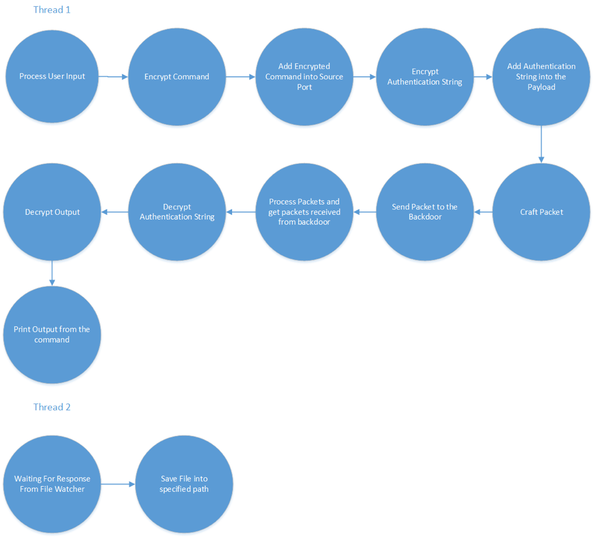

Server – Finite State Machine
-----------------------------

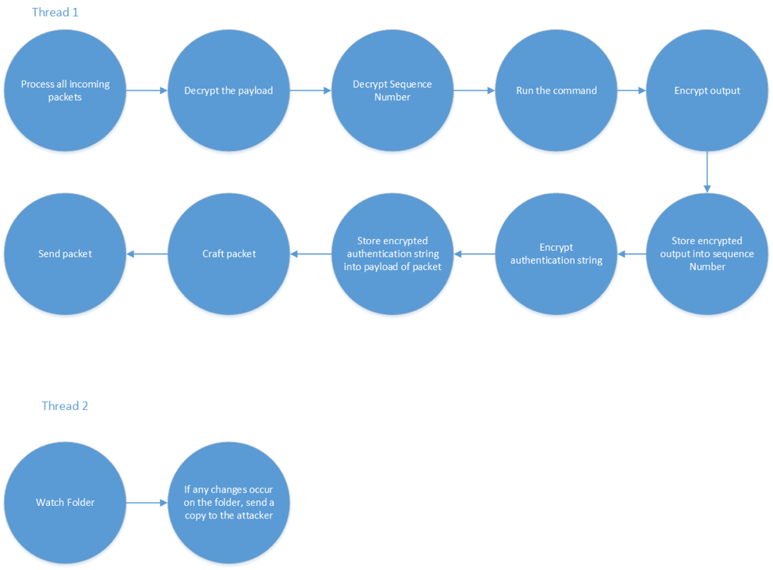

Network Diagram
---------------

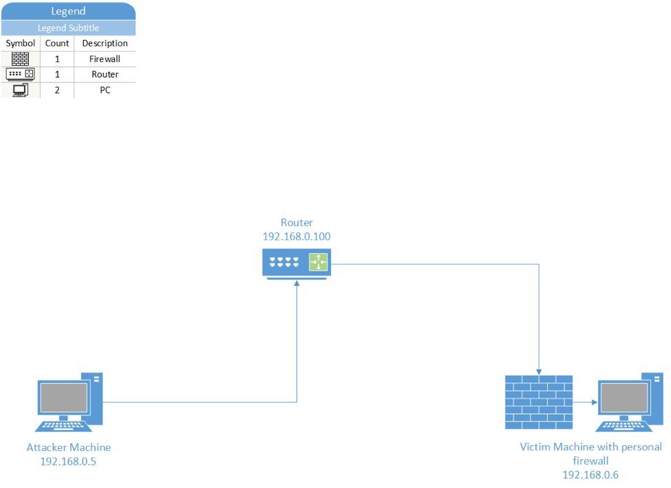

Detection
=========

One way to detect our program is if the system administrator checks the
sequence number (when we use TCP) on Wireshark because they will not be
in sequence since we hide our data inside the sequence number when using
TCP thus resulting in different sequence number. This will alert any
system administrator if they see this and will get suspicious right
away. Another way to detect our program is if the system administrator
checks the source ports (when we use UDP) on Wireshark because they will
be very different from one packet to the next. Note that we are sending
our packets as fast as we can since this is just proof of concept. One
way to mitigate that is to send our packets a lot slower.

Another way for a system administrator to detect the covert channels is
if they had already saved a whitelist for the processes running on their
machine. This way, they can simply just compare the processes running on
the machine with the whitelist and see which ones do not match the list.
They can also automate this and have a script running where it always
checks for new processes being created that’s not in the whitelist.

Prevention
==========

As a network administrator or systems analyst, there are a number of
ways in which to detect and prevent a backdoor like the one detailed in
this document from succeeding.

1.  **Process Monitoring & Whitelisting.** An analyst can ensure that no
    fake processes spin up by taking a snapshot of the system on
    first-run and then continuously maintaining a whitelist as time
    goes on. If a process starts up with a similar name when it
    shouldn’t, the administrator can choose to be notified and then act
    as necessary.

2.  **External Firewall:** If a target was separated from the internet
    via firewall or edge router, this backdoor would be useless because
    there would be no way for the firewall to forward commands to the
    victim (especially because it’s using raw sockets).

3.  **Deep Packet Inspection:** If the firewall were checking the packet
    contents, it could look for anomalies / suspicious traits, for
    example:

    a.  Looking for inconsistent sequence numbers in packets. (Packet
        one with sequence number 100000 and packet two with 102912041)

    b.  Looking at messages arriving from one host via UDP with widely
        different ports.

Tests and Results
=================
| #  | Name                                                                                                      | Resource  | Expected                                                                             | Actual      | Result | Figure        |
|----|-----------------------------------------------------------------------------------------------------------|-----------|--------------------------------------------------------------------------------------|-------------|--------|---------------|
| 1  | Server process title is masked when it is running                                                         | Server.py | Process name is masked                                                               | As expected | Pass   | 1             |
| 2  | Firewall rule DROPS every,packet                                                                          | iptables  | Firewall rules DROPS everything                                                      | As expected | Pass   | 2             |
| 3  | Client sends encrypted commands to the server (TCP)                                                       | Client.py | Client sends an encrypted,command to the server                                      | As expected | Pass   | 3             |
| 4  | Server decrypts the,encrypted command and runs the command and sends encrypted output to the,client (TCP) | Server.py | Server decrypts command and,runs it then send an encrypted output back to the client | As expected | Pass   | 4.1, 4.2      |
| 5  | Client receives the,encrypted output and decrypts it and prints it (TCP)                                  | Client.py | Client receives the output,and decrypts it then prints it                            | As expected | Pass   | 5             |
| 6  | Server monitors specific,folder and on file creation sends it to the client (UDP)                         | Server.py | If any file is created on,the folder, send it to the client                          | As expected | Pss    | 6.1,6.2       |
| 7  | Client receives the file,from the server and re-creates it (Newly created file) (UDP)                     | Client.py | Re-create the file that was,sent by the server                                       | As expected | Pass   | 7.1, 7.2, 7.3 |
| 8  | Server monitors specific,folder and on file modification sends it to the client (UDP)                     | Server.py | If any file is modified on,the folder, send it to the client                         | As expected | Pass   | 8             |
| 9  | Client receives the file,from the server,and re-creates it,(Modified) (UDP)                               | Client.py | Re-create the file that was,sent by the server                                       | As expected | Pass   | 9             |
| 10 | Client sends encrypted,commands to the server (UDP)                                                       | Client.py | Client sends an encrypted,command to the server                                      | As exoected | Pass   | 10            |
| 11 | Server decrypts the,encrypted command and runs the command and sends encrypted output to the,client (UDP) | Server.py | Server decrypts command and,runs it then send an encrypted output back to the client | As expected | Pass   | 11.1, 11.2    |
| 12 | Client receives the,encrypted output and decrypts it and prints it (UDP)                                  | Client.py | Client receives the output,and decrypts it then prints it                            | As expected | Pass   | 12            |

Figure 1: Process title changed

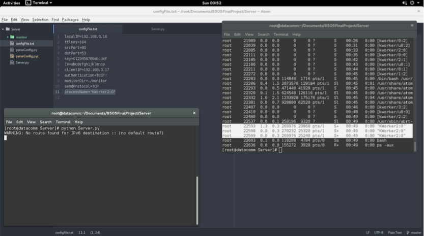

Figure 2: Firewall rule drops all packets

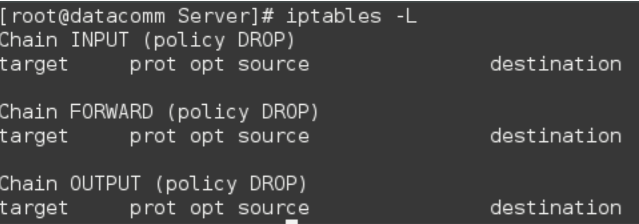

Figure 3:Client sending encrypted commands

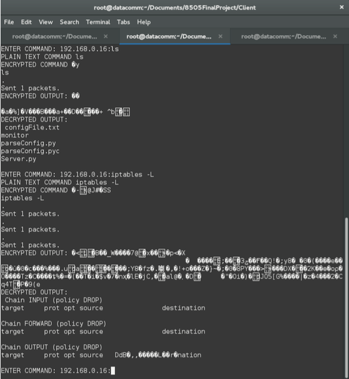

Figure 4.1: Encrypted and decrypted commands

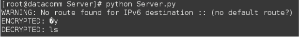

Figure 4.2: Encrypted and decrypted commands

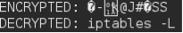

Figure 5: Shows the output

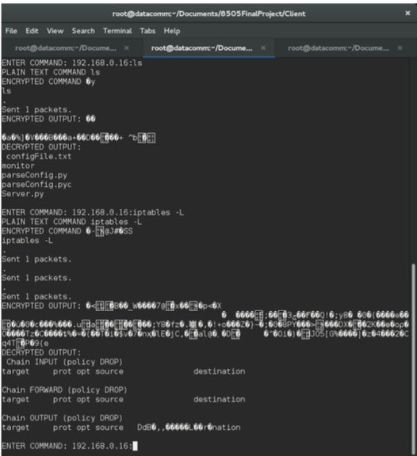

Figure 6: File creation

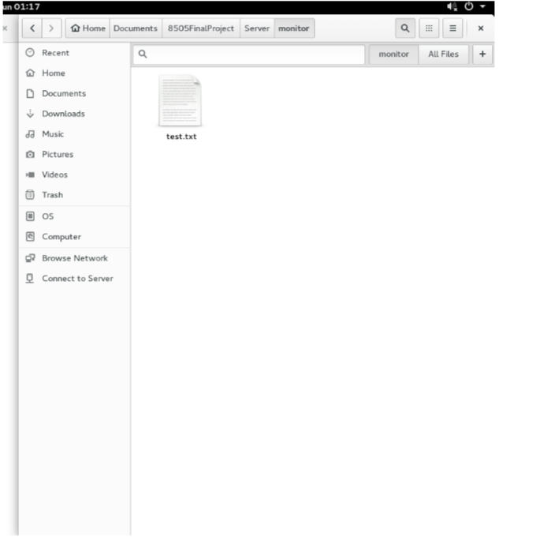

Figure 6.2: Shows the data to be compared to figure 7.3

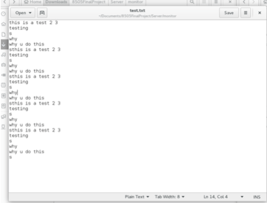

Figure 7.1: Shows empty folder

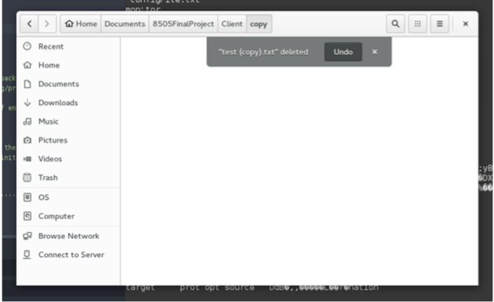

Figure 7.2: Shows the file re-created with the correct name

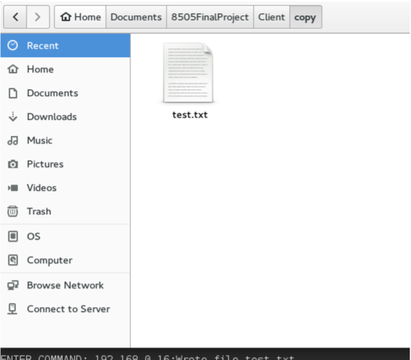

Figure 7.3: Shows the data that matches with figure 6.2

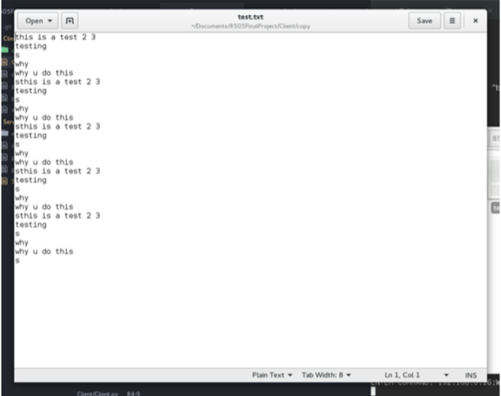

Figure 8: Changed the data inside the text file

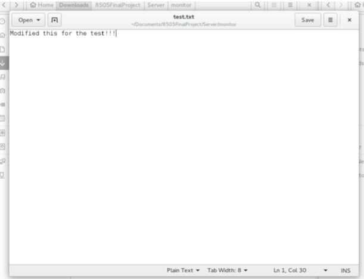

Figure 9:

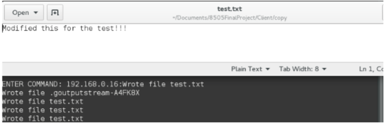

Figure 10: Sending encrypted commands (UDP)

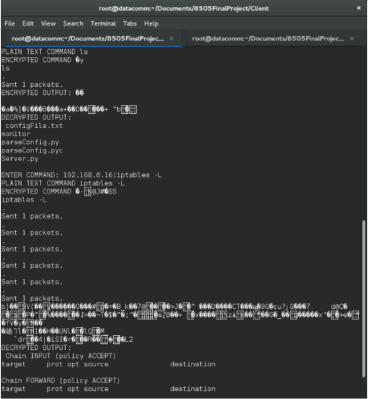

Figure 11.1: Shows the encrypted and decrypted command

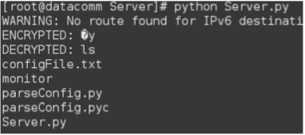

Figure 11.2: Shows the encrypted and decrypted command

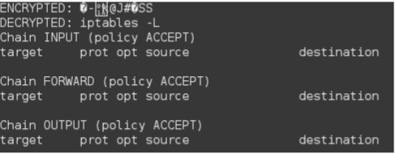

Figure 12: Shows the encrypted output and the decrypted output

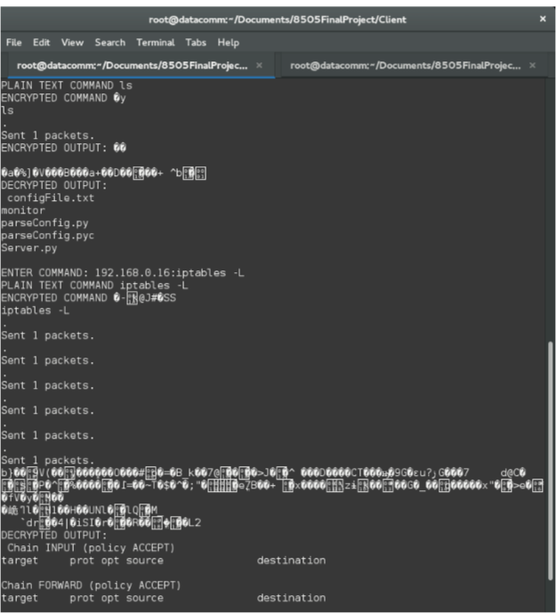

**\
**

Pseudo-code
===========

**Client.py**

1.  Read values from config file.

2.  Create two processes, one for sending / receiving commands, the
    second will be listening for file transmissions.

*Sending Commands*

1.  Prompt user for command

2.  Encrypt the command

3.  Break command down into ASCII and then binary

4.  Depending on the protocol, chunk the command into appropriate sizes.

    a.  E.g. If using TCP, we will stuff the data in the sequence number
        which can carry 32 bits)

    b.  If using UDP, stuff into source port which can carry 16 bits

5.  For each chunk, craft a packet.

    a.  Ensure that packet contains our “signature” (TTL of 71 &
        Password in the payload)

    b.  Add some sequencing options to the packet (a UID for each packet
        in the transmission, a position number and total)

6.  Send each packet.

7.  Listen for response.

*Listening for command responses*

1.  Handle all IP packets

2.  Check packet to see if it matches characteristics (e.g. TTL of 71,
    and password in payload)

3.  Grab data from covert channel fields.

4.  Add each message to a list (store by UID)

    a.  After adding , check list to see if all messages in that
        transmission have arrived

        i.  If it has, reconstruct the bits to ASCII to a human
            readable string.

        ii. Decrypt the output.

*Listen for files*

1.  Handle all IP packets coming in on port 80

2.  Check packet to see if it matches characteristics (e.g. TTL of 71,
    and password in payload)

3.  Grab data from covert channel fields.

4.  Add each message to a list (store by UID)

    a.  After adding, check list to see if all messages in that
        transmission have arrived

<!-- -->

1.  If it has, reconstruct the binary.

2.  Decrypt the binary.

3.  Write the binary to a file.

**Server.py**

1.  Read values from config file.

2.  Start two processes, one for receiving commands/sending output and
    the one for for monitoring a file directory.

*Listening For Commands*

1.  Handle all IP packets

2.  Check packet to see if it matches characteristics (e.g. TTL of 71,
    and password in payload)

3.  Grab data from covert channel fields.

4.  Add each message to a list (store by UID)

    a.  After adding , check list to see if all messages in that
        transmission have arrived

        i.  If it has, reconstruct the bits to ASCII to a human
            readable string.

        ii. Decrypt the output.

        iii. The output is the command, so execute the command.

            1.  Get the output of the command then Encrypt the message

            2.  Break message down into ASCII and then binary

            3.  Depending on the protocol, chunk the message into
                appropriate sizes.

                a.  E.g. If using TCP, we will stuff the data in the
                    sequence number which can carry 32 bits)

                b.  If using UDP, stuff into source port which can carry
                    16 bits

            4.  For each chunk, craft a packet.

                a.  Ensure that packet contains our “signature” (TTL of
                    71 & Password in the payload)

                b.  Add some sequencing options to the packet (a UID for
                    each packet in the transmission, a position number
                    and total)

            5.  Send each packet.

*Monitor Files*

1.  Observe directory for changes.

2.  On change, raise an event.

3.  Handle event.

    a.  If it’s a deletion, do nothing.

    b.  If it’s an addition (which covers file renames as well) then

        i.  Get file.

        ii. Break file down into binary.

        iii. Encrypt that binary.

            1.  Depending on the protocol, chunk the message into
                appropriate sizes.

                a.  E.g. If using TCP, we will stuff the data in the
                    sequence number which can carry 32 bits)

                b.  If using UDP, stuff into source port which can carry
                    16 bits

            2.  For each chunk, craft a packet.

                a.  Ensure that packet contains our “signature” (TTL of
                    71 & Password in the payload)

                b.  Add some sequencing options to the packet (a UID for
                    each packet in the transmission, a position number
                    and total)

            3.  Send each packet.

